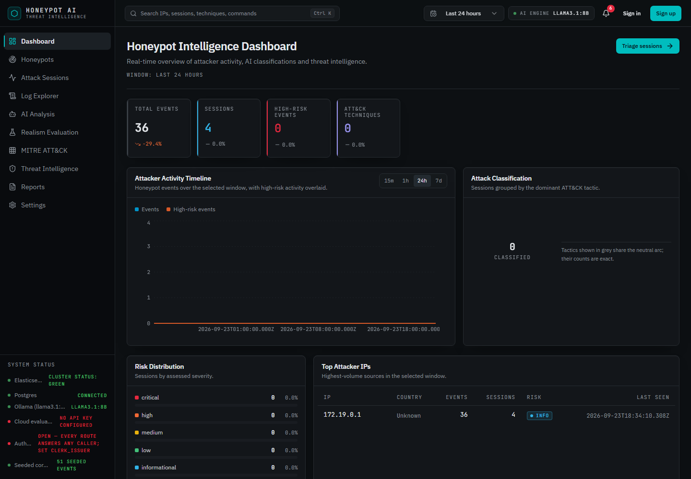
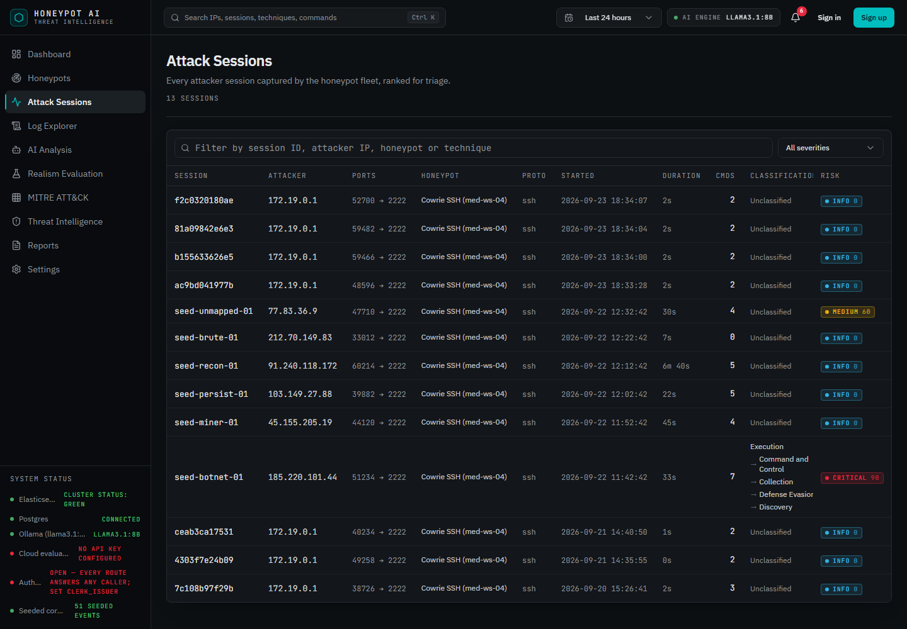
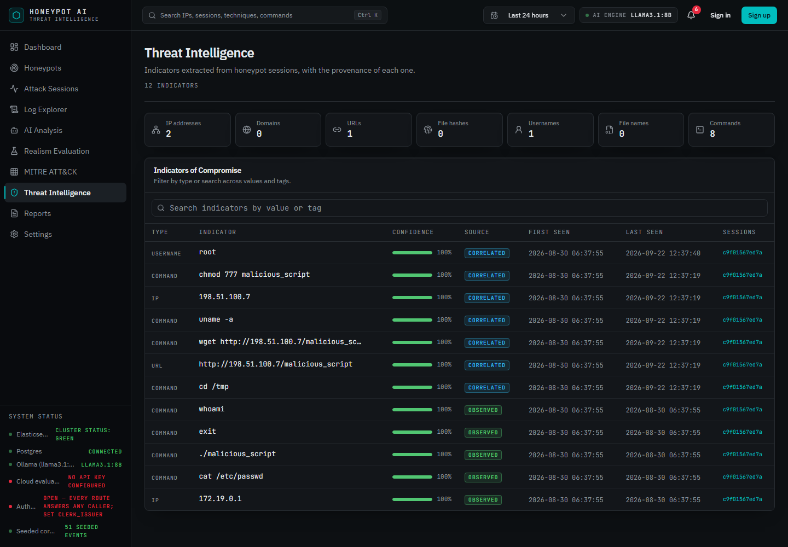
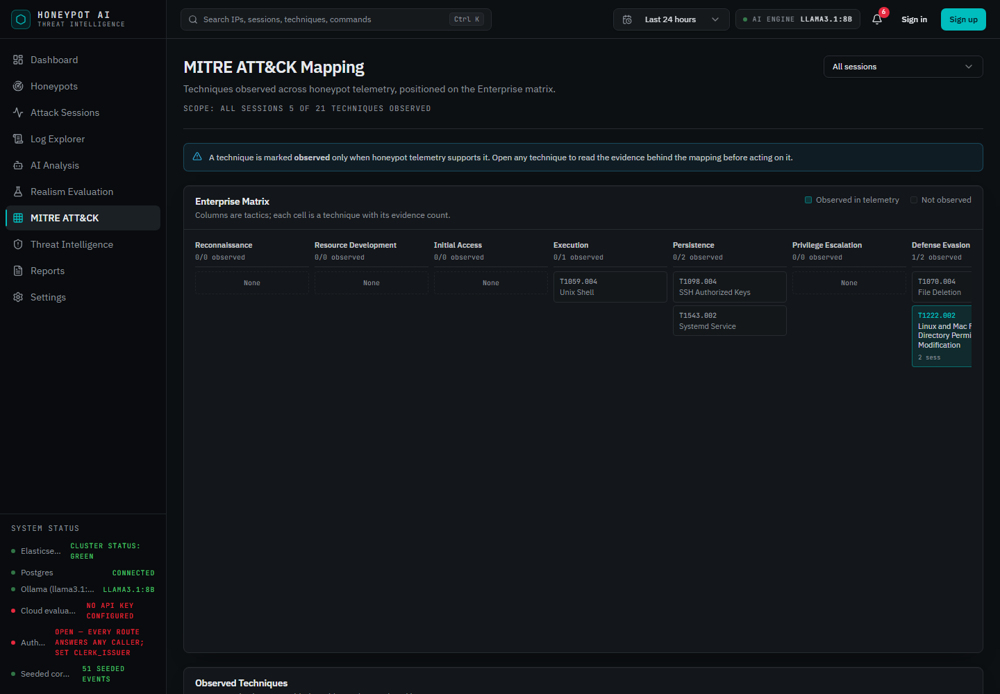
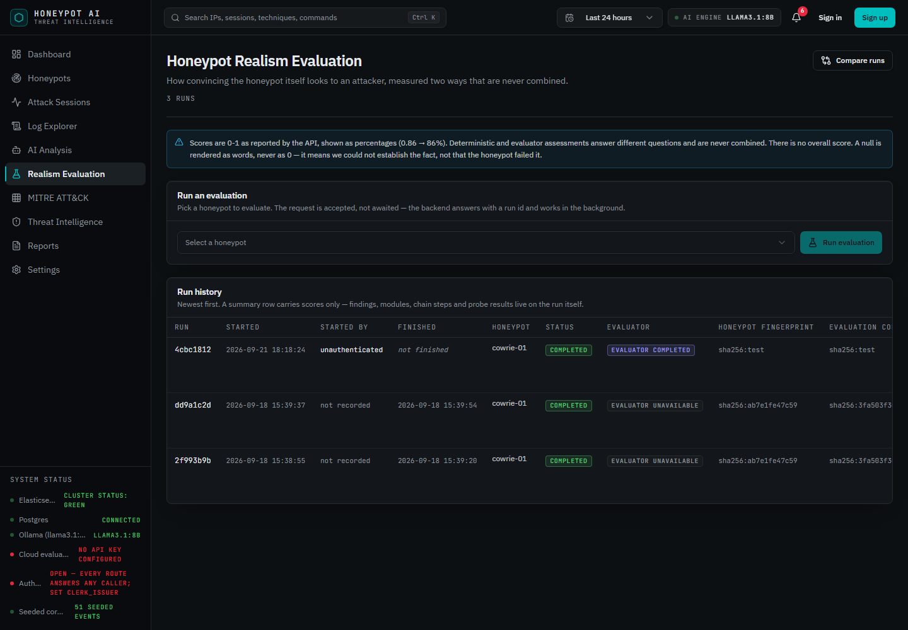

# Hivemind

**Evidence-grounded honeypot analysis, and automated evaluation of the honeypot itself.**

Hivemind does two things with one honeypot.

It **analyses attacks**: ingesting live telemetry, reconstructing attacker sessions,
classifying behaviour with a local LLM, mapping commands to MITRE ATT&CK, extracting
indicators of compromise, and producing threat reports.

Then it **turns around and attacks the honeypot itself**: an SSH agent and a set of
static probes exercise the decoy across six characteristics and report how convincing it
would look to an intruder, so a developer learns where the illusion breaks before an
attacker does.

Its defining property is **provenance**: every conclusion the interface shows expands
into the exact log line that produced it, and nothing is presented as fact unless
telemetry supports it. An ATT&CK technique is marked *observed* only when a deterministic
rule matched the command — never because a model suggested it — and a fact nobody could
establish is reported as unknown rather than as a zero.

Based on *"Beekeeper: Accelerating Honeypot Analysis With LLM-Driven Feedback"*
(Ilg, Germek, Duplys & Menth, IEEE Access vol. 13, 2025).

> **Why is it built this way?** [`OVERVIEW.md`](OVERVIEW.md) covers the design rationale,
> the full feature list and the technical reference — every operational detail that used
> to live in this file.

---

## Screenshots

**Dashboard** — fleet-wide attacker activity over a selected window.



**Attack sessions** — every captured session ranked for triage, with its risk score and
the ATT&CK tactic chain it exercised.



**Threat intelligence** — extracted indicators, each carrying its own provenance tier.
`OBSERVED` came straight from telemetry; `CORRELATED` was derived across more than one
session.



**MITRE ATT&CK mapping** — techniques positioned on the Enterprise matrix, with the count
of evidence behind each one.



**Realism evaluation** — run history for the half that attacks the honeypot, with both
fingerprints, the evaluator's status and who started each run.



---

## Installation

### Requirements

| | |
|---|---|
| Docker Desktop | runs Cowrie, Filebeat, Elasticsearch, Kibana, Postgres |
| Python | 3.12 |
| Node.js | 20+ |
| [Ollama](https://ollama.com) | on the host, for GPU access |
| GPU | 8 GB VRAM is sufficient |
| `nmap` | optional — the service-scan probe reports `unknown` without it |

The packet-capture sidecar (`nicolaka/netshoot`, pinned by digest) is declared in
`docker-compose.yml` and pulled with everything else.

### 1. Infrastructure

```bash
docker compose up -d
```

Brings up Elasticsearch (`:9200`), Kibana (`:5601`), Postgres (`:5432`), Cowrie
(`:2222` SSH, `:2223` Telnet) and Filebeat. Every port binds to `127.0.0.1` only.

### 2. Local model

```bash
ollama pull llama3.1:8b
```

Confirm it runs on the GPU — `ollama ps` must report `100% GPU`. A silent fall back to
CPU makes every analysis several times slower with no error.

### 3. Backend

```bash
cd backend
python -m venv .venv
.venv/Scripts/python -m pip install -e ".[dev]"       # Linux/macOS: .venv/bin/python
cp .env.example .env                                  # optional — every value is a default
.venv/Scripts/python -m alembic upgrade head
EVALUATION_TARGET_HOST=127.0.0.1 .venv/Scripts/python -m uvicorn app.main:app --port 8000
```

On first start the backend installs the Elasticsearch ingest pipeline and index
template, then seeds a deterministic corpus so every screen has data before any attacker
connects.

`EVALUATION_TARGET_HOST` matters only for the realism evaluation: it defaults to the
compose service name `cowrie`, which does not resolve from a backend running on the host.

### 4. Frontend

```bash
cd frontend
npm install
echo "VITE_API_BASE_URL=http://localhost:8000" > .env
npm run dev
```

Open <http://localhost:8080>. Without `VITE_API_BASE_URL` the app runs on built-in demo
data instead — useful for a UI-only look, and every surface that renders it is badged.

### 5. Generate traffic (optional)

```bash
ssh -p 2222 root@127.0.0.1     # any password is accepted
```

Type a few commands, then `exit`. They appear in the Log Explorer within seconds.
A scripted generator is also available:

```bash
cd backend && .venv/Scripts/python scripts/generate_traffic.py
```

### Tests

```bash
cd backend && .venv/Scripts/python -m pytest
cd frontend && npx tsc --noEmit && npm run lint && npm run build
```

The backend suite runs against the live Docker stack and the real local model, so bring
the infrastructure up first. A clean run is `653 passed, 1 skipped`.

---

## License

Licensed under the [Apache License 2.0](LICENSE).

Cowrie is deliberately attackable software. Its ports bind to `127.0.0.1` only and it
must not be exposed to the internet in this configuration.
